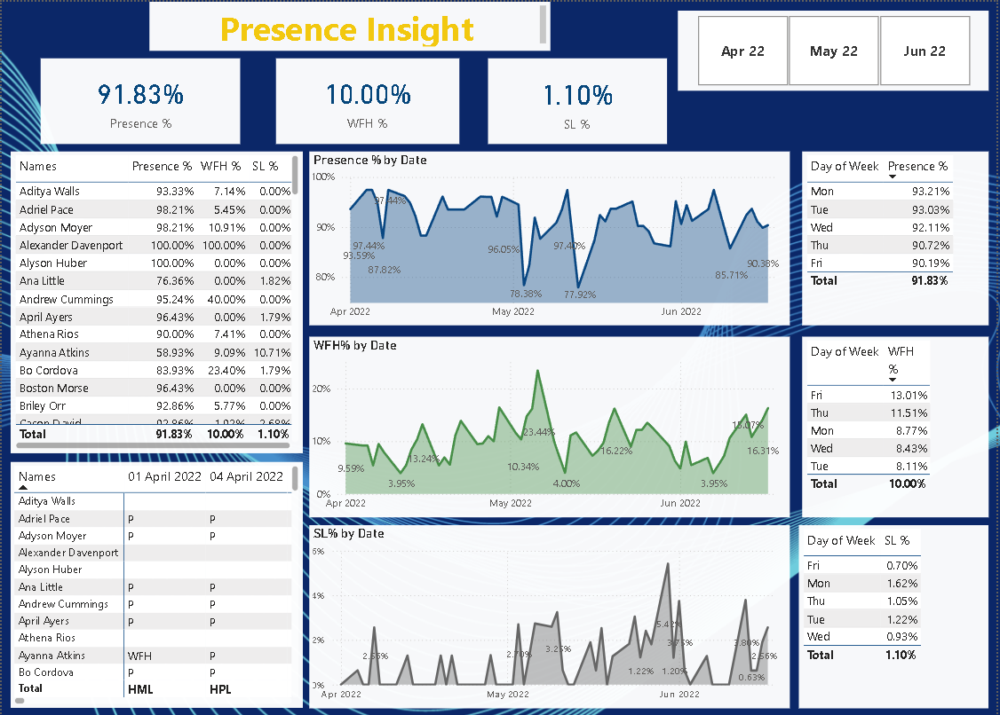

# HR_analytics

---

#  HR Analytics Power BI Dashboard — Employee Presence & Leave Insights

Welcome to my **HR Analytics Dashboard** project, built using **Power BI** to visualize, analyze, and track **employee presence, work-from-home (WFH) trends, 
and sick leaves (SL%)**.  
This project helps HR teams make **data-driven workforce decisions**, replacing manual reports with interactive visual storytelling.




** Objective**  
To create a comprehensive dashboard that allows HR and leadership teams to monitor workforce attendance behavior across months, days, and individuals.

**💼  Human Resources  
**🧰  Power BI, Power Query, DAX

---

##  Key Metrics Tracked

| Metric        | Description                                                |
|---------------|------------------------------------------------------------|
| Presence %    | Percentage of days employee was present                    |
| WFH %         | Days an employee worked remotely                           |
| SL %          | Sick leaves taken by employees                             |

---

##  Dashboard Features

- 📅 **Time Trends**: Line charts showing daily trends for Presence %, WFH %, and SL %
- 🔍 **Day of Week Analysis**: Insights into which weekdays are most remote or sick
- 🧑‍💼 **Employee-Level Table**: View presence and leave metrics by name
- 📈 **Interactive Filtering**: Drill down by month, name, and day
- 🧾 **Leave Type Breakdown**: Home Leave (HML) vs Paid Leave (HPL) comparison

---

## Sample Insights

- **Average Presence Rate**: 91.83%
- **Friday** had the highest WFH rate: **13.01%**
- **Monday** had the highest Sick Leave rate: **1.62%**
- Certain employees maintained **100% presence** and others had **50% or less**

---

##  Business Impact

✅ Enables real-time tracking of employee attendance  
✅ Informs hybrid work policy adjustments  
✅ Replaces weekly Excel reports and manual efforts  
✅ Helps HR identify chronic absenteeism or policy misuse

---

## 🛠 Tools & Technologies

- **Power BI** for visualization and dashboard creation  
- **Power Query** for data cleaning and transformation  
- **DAX** for KPI calculations (Presence %, SL %, WFH %)  
- **Excel** (initial source data format)

---

## File Structure

```bash
├── Dashboard Screenshot (new.png)
├── Power BI File (HR_Presence_Insights.pbix)
├── Sample Data (data_cleaned.xlsx)
└── README.md
```

---

## Let’s Collaborate

Feel free to fork this repo, use it for your HR data projects, or suggest improvements!  
📬 [Connect on LinkedIn](https://www.linkedin.com/in/firdousrahmani)  


---


`#PowerBI` `#HRAnalytics` `#DataAnalytics` `#DAX` `#DashboardDesign`  
`#PresenceTracking` `#WFHAnalysis` `#PowerQuery` `#PeopleAnalytics`

